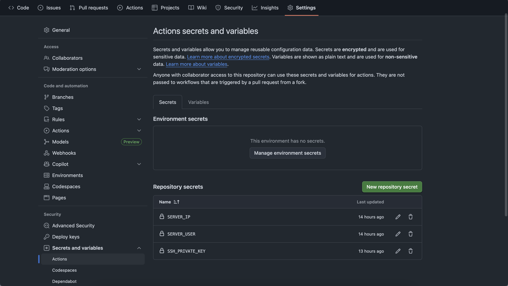

## 初识CICD

​	 	 最早听到CICD这个名词是在今年寒假的字节青训营，但彼时的我对于web开发一无所知。经过将近两个月的项目经历，对于各种组件和开发流程的认识也愈加清晰。

​		web开发流程中，后端开发接口后前端需要去测试，因此将开发好的接口及时上线到服务器上供前端访问是非常有必要的。而在之前的开发流程中我的工作流like：


​		这种流程需要每次都SSH连接服务器再次构建程序，非常的麻烦。那一定是有一种更好的办法的，比如**CICD**。


​		通过github-action同步代码到服务器再执行自动化脚本就方便多了。


 ### 1.生成RSA密钥对：

1. **生成 RSA 密钥对：**

   ```
   ssh-keygen -t rsa -b 4096 -f ~/.ssh/my_new_rsa_key
   ```

2. **查看生成的 PEM 格式私钥内容：**

   ```
   cat ~/.ssh/my_new_rsa_key
   ```

   将私钥存储在GitHub中 SSH_PRIVATE_KEY变量里。

3. **将对应的公钥添加到服务器的 `~/.ssh/authorized_keys` 文件中。**

   ```
   cat ~/.ssh/my_new_rsa_key.pub
   ```

   复制此文件内容，添加到服务器的 `~/.ssh/authorized_keys` 文件末尾。
   
   

### 2.github secret配置

将上方生成RSA私钥配置在SSH_PRIVATE_KEY中，然后配置SERVER_IP、SERVER_USER变量



### 3.安装rsync
`sudo yum install rsync -y`
通过该命令CentOS 7系统中安装rsync，用于同步github仓库内容到服务器

​	下面的代码就非常好懂了，将它保存在github repo下的.github/workflows路径下即可

```yml
name: Front-CI 

on:
  push:
    branches:
      - main
  pull_request:
    branches:
      - main

jobs:
  front-ci: # CI Job：运行代码检查、测试等，确保代码质量
    runs-on: ubuntu-latest
    steps:
      - name: Checkout code
        uses: actions/checkout@v4

      - name: Setup Node.js
        uses: actions/setup-node@v4
        with:
          node-version: 23 # Node.js 版本

      - name: Install dependencies
        run: npm install # 安装依赖

  front-cd: 
    runs-on: ubuntu-latest
    needs: front-ci # 确保 front-ci Job 成功后才运行此 Job
    if: github.event_name == 'push' #每次push操作都触发action

    steps:
      - name: Checkout code
        uses: actions/checkout@v4 # 部署Job也需要拉取代码，因为它是独立运行的环境

      - name: Setup Node.js
        uses: actions/setup-node@v4
        with:
          node-version: 23 

      - name: Install dependencies # 再次安装依赖，确保构建环境完整
        run: npm install

      - name: setup blog 
        run:  npm run build

      - name: Deploy via rsync of website #配置rsync同步到服务器
        uses: easingthemes/ssh-deploy@v2.1.6
        env:
         SSH_PRIVATE_KEY: ${{ secrets.SSH_PRIVATE_KEY }} #访问服务器就得需要密钥
         ARGS: "-rltgoDzvO"
         SOURCE: "./dist"
         REMOTE_HOST: ${{ secrets.SERVER_IP }}
         REMOTE_USER: ${{ secrets.SERVER_USER }}
         TARGET: "/usr/local/www/html/myblog/src/"  # 服务器目标路径

```

最后在github随意提交一个commit，即可在actions中看到对应的执行过程。

